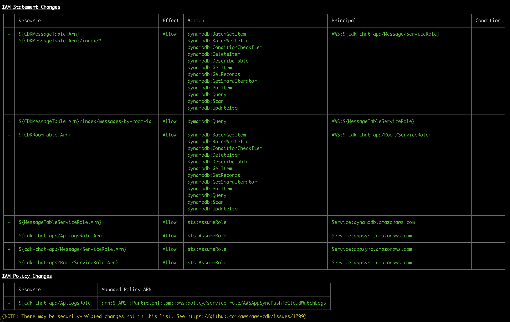

1. cd appsync-chat-backend
2. npm install or yarn
3. if needed use `npm install -g npm-check-updates` and `ncu -u` to update dependencies
4. cdk deploy

- creates, appSync cdk-chat-app, user and room dynamodb table. cognito userpool  

4. Building client app for appSync API(using amplify graphql client): https://docs.aws.amazon.com/appsync/latest/devguide/building-a-client-app.html 

Resources:
https://github.com/amazon-archives/aws-mobile-appsync-events-starter-react
